# Mentor Bootcamp Admin Dashboard

A full-stack, authenticated web application designed for administrators to manage bootcamp content, media uploads, student data, and doubts. 

## 🏗 Architecture & Stack
- **Database:** MySQL
- **ORM:** Sequelize (Object-Relational Mapper)
- **Backend:** Node.js with Express.js
- **Frontend:** React.js (with GSAP for animations, Recharts for analytics)
- **Authentication:** Google OAuth + JSON Web Tokens (JWT) via Passport.js

---

## 🚀 Key Features & Backend Design

### 1. Database Configuration (`config/db.js`)
- Initializes Sequelize to interact with MySQL using standard JS objects instead of raw SQL queries.
- Connects using environment variables: `DB_HOST`, `PORT`, `NAME`, `USER`, `PASSWORD`.
- Contains `ADMIN_EMAILS` and `JWT_SECRET` for verifying admin tokens.

### 2. Authentication Flow
- **OAuth setup:** Uses Google Cloud Console to create an OAuth client with a redirect URL (`/auth/google/callback`).
- **Passport.js & Middleware:** Handles the Google OAuth login. If it's a user's first login, they are added to the User database.
- **Role Verification:** The system checks if the logged-in email matches the `ADMIN_EMAILS` in `.env`. If it matches, the user is granted the `ENUM('admin')` role.
- **JWT Implementation:** 
  - On successful callback, the backend returns a JWT token to the React frontend.
  - The React frontend (`Login.jsx` & `Dashboard.jsx`) grabs the token, saves it to `localStorage`, and attaches it as a `Bearer <token>` in the Authorization headers for future API requests via Axios.
  - `auth.js` middleware parses incoming headers, checks the token using `JWT_SECRET` and `jsonwebtoken`, and decrypts the user payload.
  - `isAdmin.js` middleware specifically checks for Admin access. It returns `401 Unauthorized` or `403 Forbidden` if validation fails.

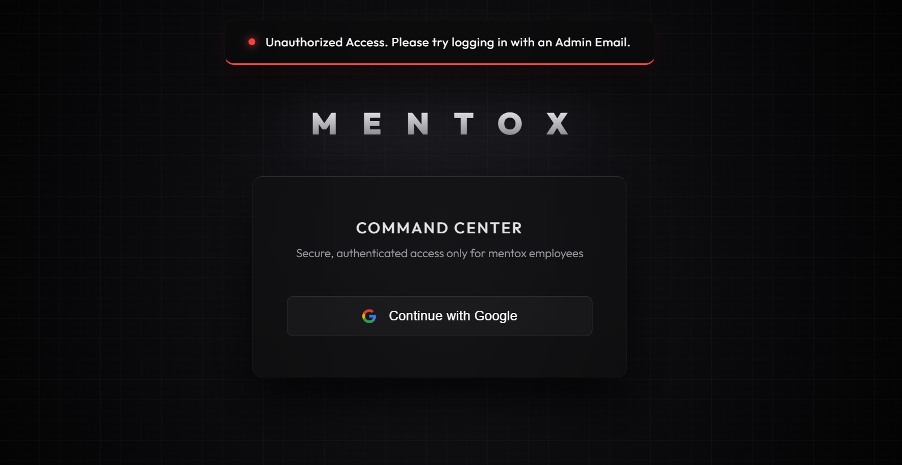

### 3. Frontend Routing & Structure (`test_admin_frontend`)
- **App.jsx:** Uses Protected Routes to verify local storage tokens before granting dashboard access.
- **Dashboard Layout:** Wrapped using React Router's `<Outlet />` to render sub-components inside a persistent sidebar layout.
- **Sidebar Modules:** 
  - Manage Posts (`postManager.jsx`)
  - Audit History (`AuditHistory.jsx`)
  - Profile (`profile.jsx`)
  - Students (`studentList.jsx`)
  - Doubts (`solveDoubts.jsx`)

### 4. Analytical Dashboard
- Uses `recharts` for visual analytics and data tracking.
- Every time the admin website opens, the frontend uses `getMe` (`GET /auth/me`) to verify the token is still valid.

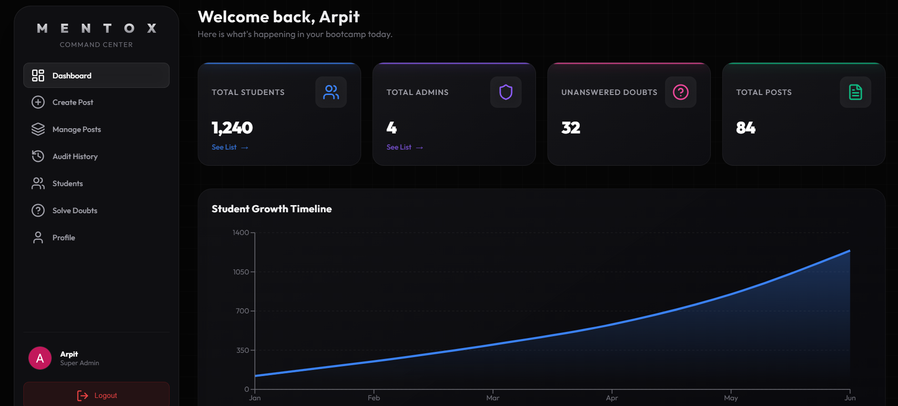
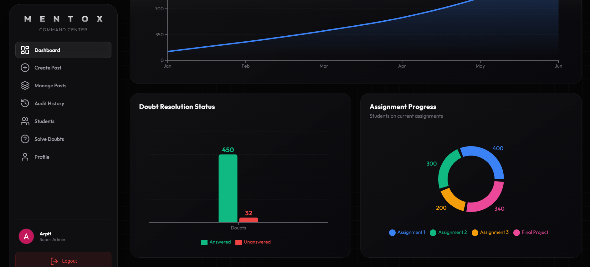

---

## 📝 Bootcamp Post Management
Admins can perform full CRUD operations on bootcamp posts via `BootcampController.js`.

### Models & Schema (`models/BootcampPost.js` & `models/Index.js`)
- **Structure:** Sequelize blueprint defines tables and columns automatically via `sequelize.sync()`.
- **Relations:** A User `hasMany` Posts, and a Post `belongsTo` a User.
- **Data Types:** Uses `DataType.ENUM` for post types (`'photo'`, `'video'`, `'message'`, `'poll'`). 
- **JSON Arrays:** Tags and poll options are stored natively as JSON arrays in the MySQL model to support dynamic frontend creation.

### Uploading Media (Multer + Axios)
- **Multipart Form-Data:** Browsers use `multipart/form-data` to send raw binary files. Express uses `multer` to intercept these envelopes because native JSON cannot handle binaries.
- **File Routing:** Depending on the payload, `upload.js` safely saves files to either a `photos/` or `videos/` directory on the hard drive *before* the controller logic runs. It uses `crypto` to rename files securely to prevent name collisions.
- **Axios vs Fetch:** The frontend uses Axios because it handles complex data (like `FormData`) better and features automatic JSON parsing and error catching.
- **API Security:** Routes are stacked: `router.post('/photo', auth, isAdmin, upload.single('photo'), BootcampController.uploadMedia)`. The controller only saves the generated file URL to MySQL after all middleware approves.

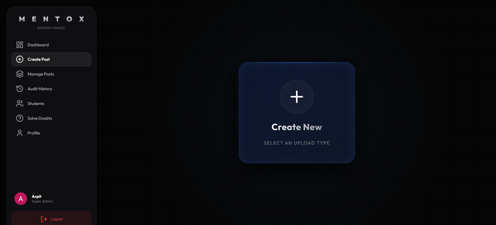
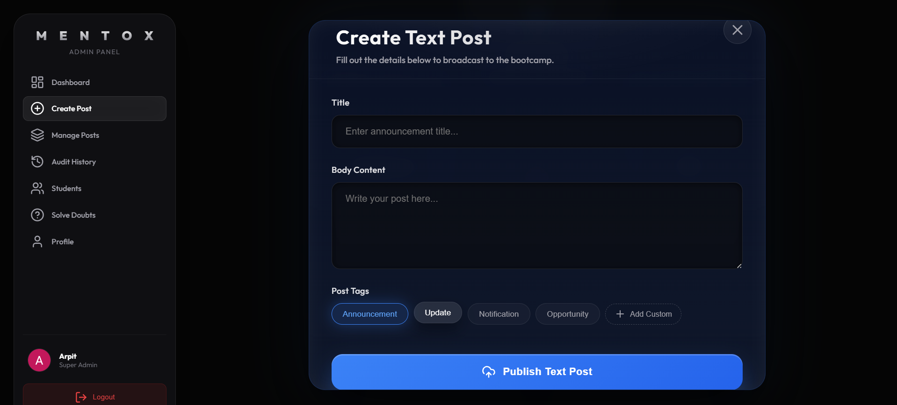
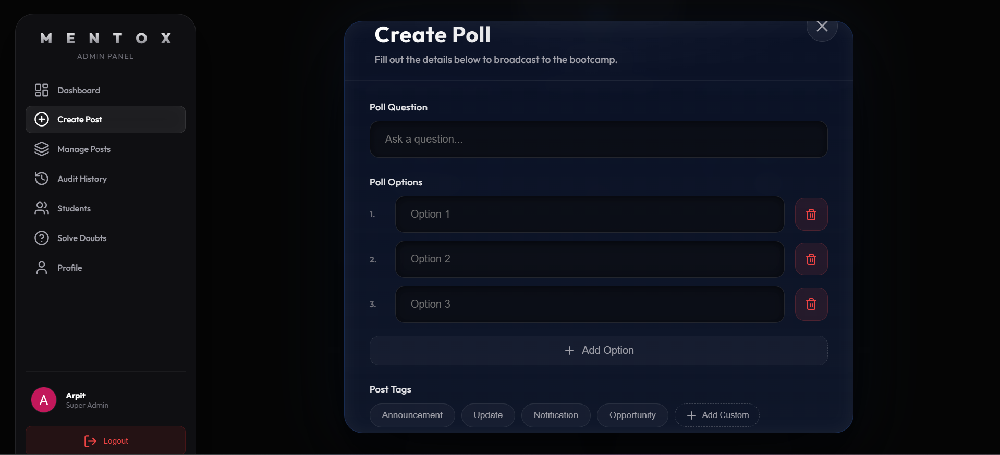
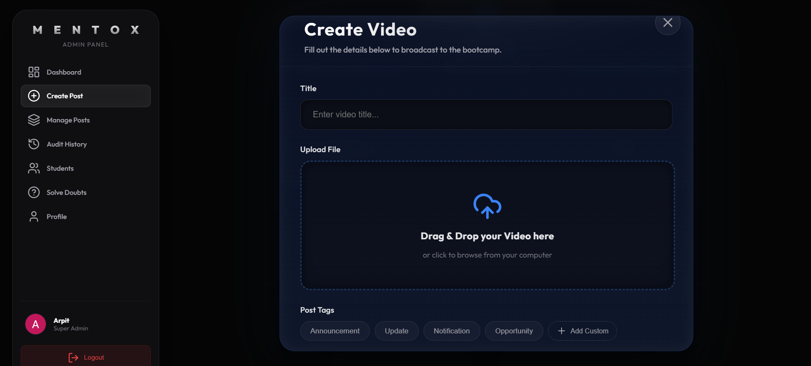

**Video Upload Demonstration:**

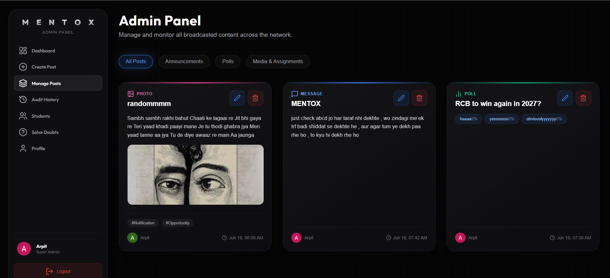
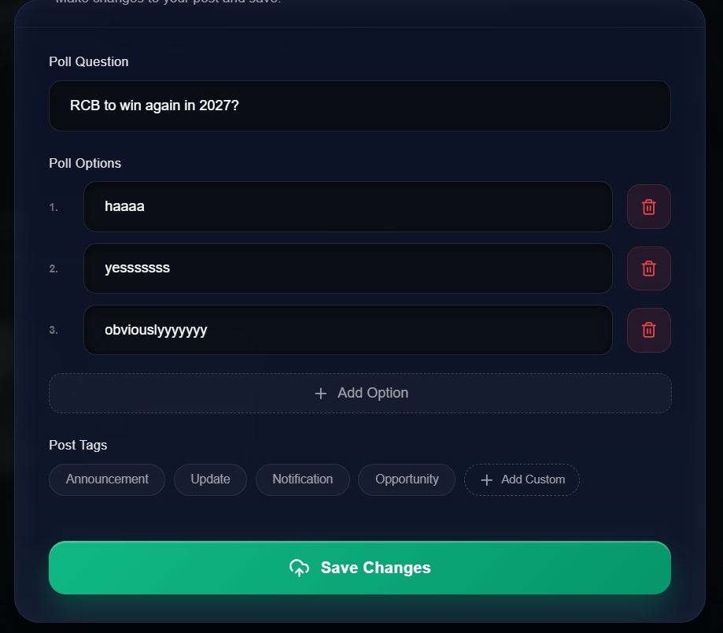

---

## 📜 Audit Logs
- **Tracking:** Every major action (Create Message, Upload Media, Update Post, Delete Post, Answer Doubt) invokes `AuditLog.create()` to record the event.
- **Database Joins:** The `getAuditLogs` controller fetches records using an `include` clause to join the `User` table. This allows the API to return the exact Admin's name and profile picture who performed the action.
- **Endpoint:** `GET /` audit route fetches all logs.

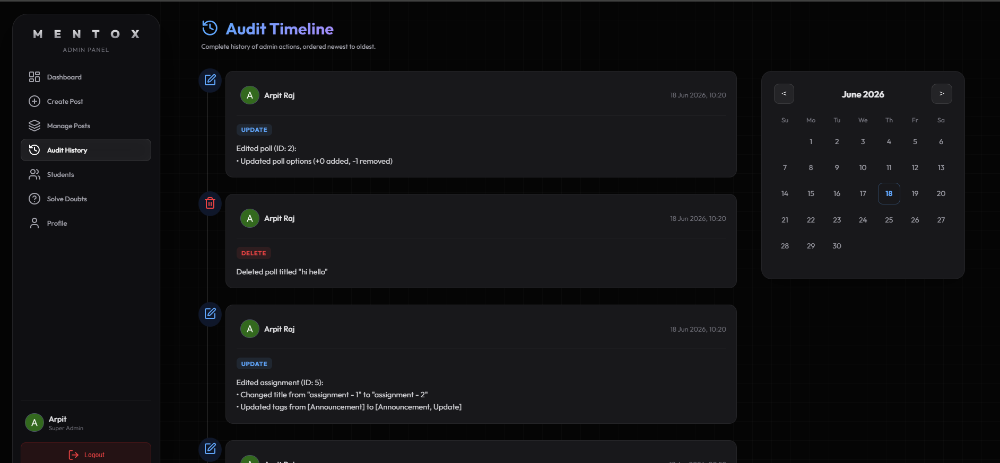

---

## 👥 User Management (Students & Admins)
- **Student Data:** Dedicated pages for student lists and comprehensive overviews.
- **Admin Tracking:** Dedicated list to view all active admins and their respective overviews.
- **Profile Module:** A profile view where admins can view and update their personal details. GSAP animations are utilized throughout the application for a premium feel (such as pop-ups when clicking post cards).

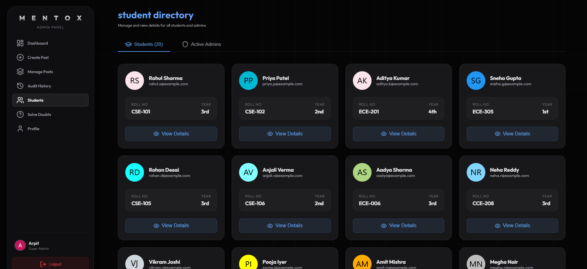
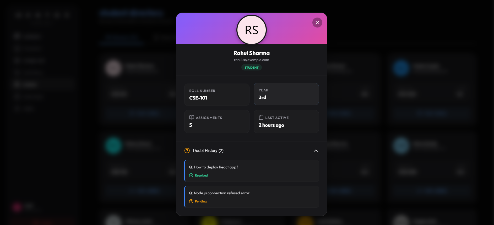
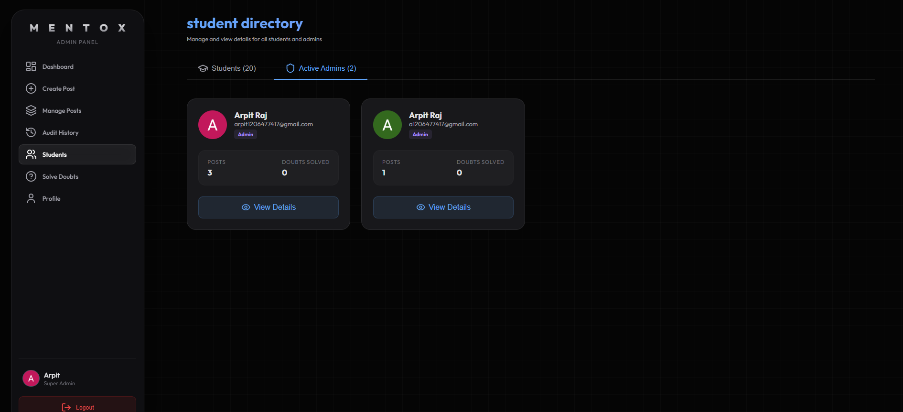
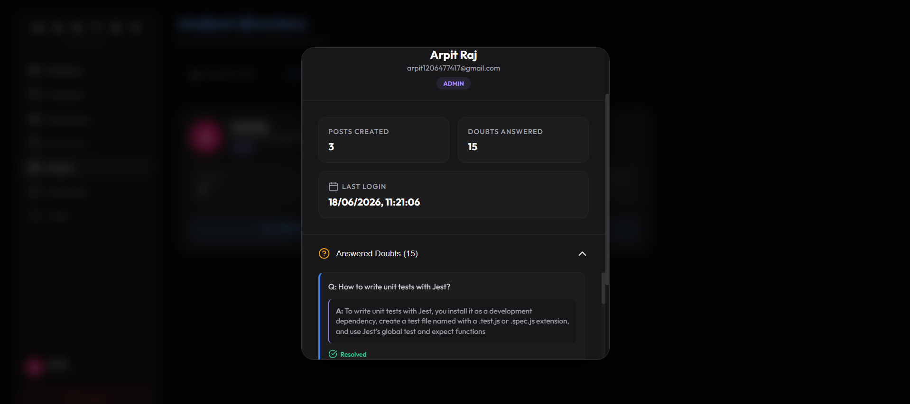

### Profile Update Animation
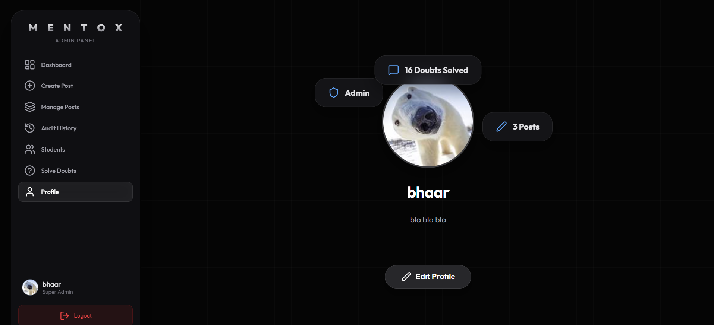

---

## ❓ Doubt Resolution & Assignments
- **Doubt Handling:** Dedicated routes (`DoubtRoute.js`) and controllers (`DoubtController.js`).
- **Endpoint:** Admin answers trigger a `PUT /api/doubts/:id/answer` endpoint, which immediately hooks into the Audit Log to track who solved it.
- **Assignment Tracking:** Expanding the database with assignment tracking models, tracking `id`, `studentId`, `assignmentId`, and `completedAt` timestamps using Sequelize.

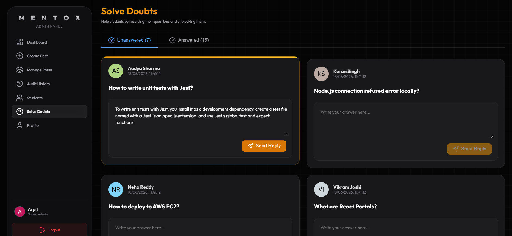
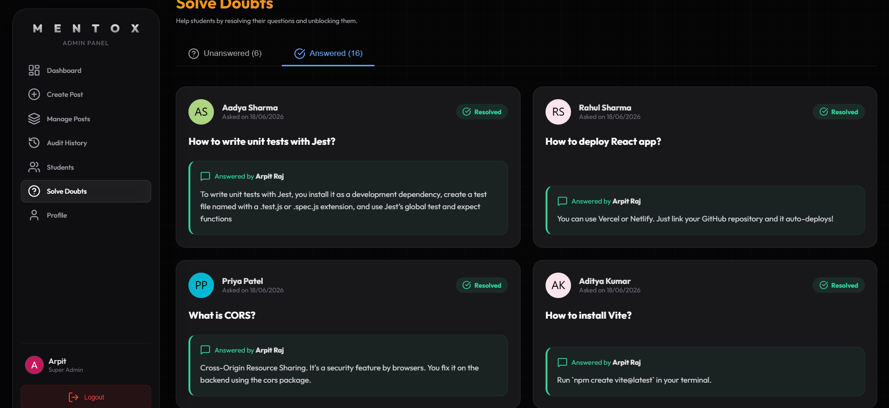
